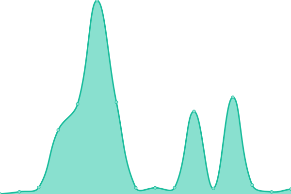

# [📈 Live Status](https://MediaPlay-Discord.github.io/status): <!--live status--> **🟥 Complete outage**

This repository contains the open-source uptime monitor and status page for [MediaPlay-Discord](https://MediaPlay-Discord.github.io/status), powered by [Upptime](https://github.com/upptime/upptime).

With [Upptime](https://upptime.js.org), you can get your own unlimited and free uptime monitor and status page, powered entirely by a GitHub repository. We use [Issues](https://github.com/MediaPlay-Discord/status/issues) as incident reports, [Actions](https://github.com/MediaPlay-Discord/status/actions) as uptime monitors, and [Pages](https://MediaPlay-Discord.github.io/status) for the status page.

<!--start: status pages-->
<!-- This summary is generated by Upptime (https://github.com/upptime/upptime) -->
<!-- Do not edit this manually, your changes will be overwritten -->
<!-- prettier-ignore -->
| URL | Status | History | Response Time | Uptime |
| --- | ------ | ------- | ------------- | ------ |
|  [Website](https://mediaplay-discord.github.io) | 🟥 Down | [website.yml](https://github.com/MediaPlay-Discord/status/commits/HEAD/history/website.yml) | 

 102ms
     
 | 

<a href="https://MediaPlay-Discord.github.io/status/history/website">100.00%</a>
    

|  [MediaNext](https://the-bot.thein321.repl.co) | 🟥 Down | [media-next.yml](https://github.com/MediaPlay-Discord/status/commits/HEAD/history/media-next.yml) | 

 2923ms
     
 | 

<a href="https://MediaPlay-Discord.github.io/status/history/media-next">97.46%</a>
    

|  [Discord (3rd Party)](https://discord.gg/nj7rV6p8gS) | 🟥 Down | [discord-3rd-party.yml](https://github.com/MediaPlay-Discord/status/commits/HEAD/history/discord-3rd-party.yml) | 

 298ms
     
 | 

<a href="https://MediaPlay-Discord.github.io/status/history/discord-3rd-party">100.00%</a>
    

<!--end: status pages-->

[**Visit our status website →**](https://MediaPlay-Discord.github.io/status)

## 📄 License

- Powered by: [Upptime](https://github.com/upptime/upptime)
- Code: [MIT](./LICENSE) © [MediaPlay-Discord](https://MediaPlay-Discord.github.io/status)
- Data in the `./history` directory: [Open Database License](https://opendatacommons.org/licenses/odbl/1-0/)
